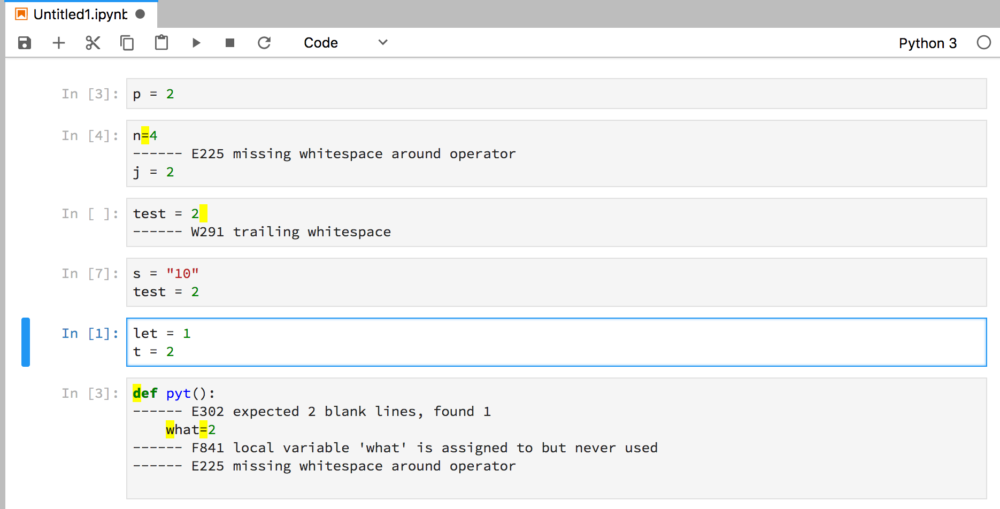
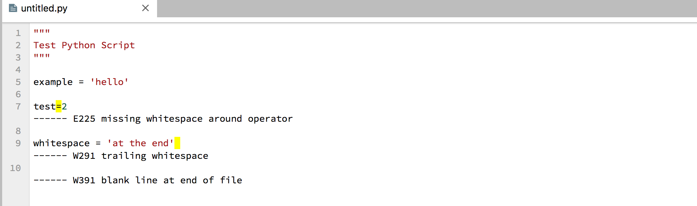
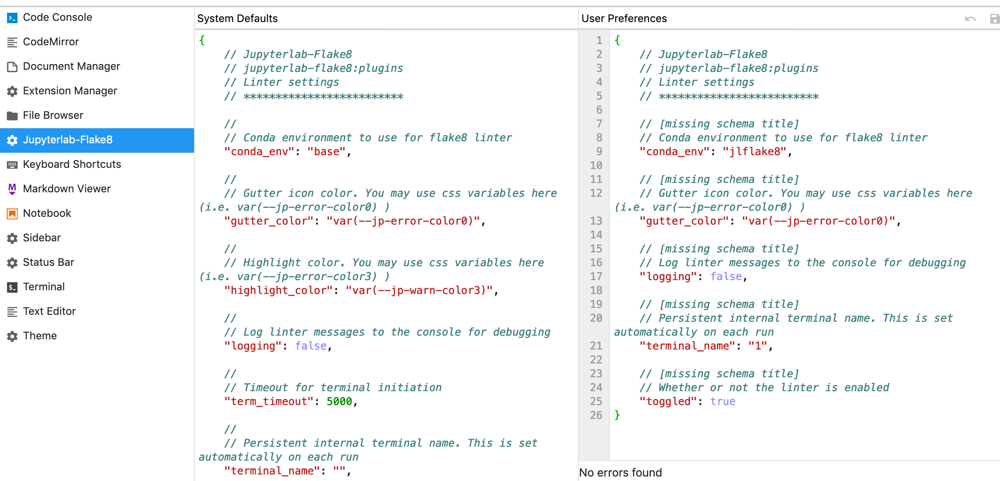
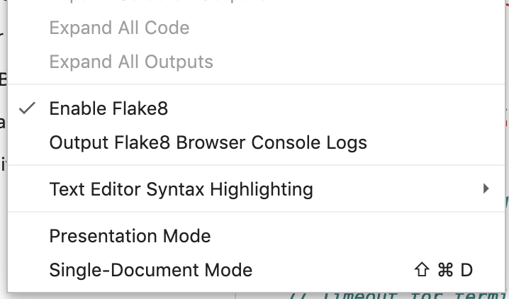

# Jupyterlab-flake8

[](https://github.com/mlshapiro/jupyterlab-flake8/actions/workflows/build.yml)

Jupyterlab extension to lint python notebooks and python files in the text editor. Uses [`flake8`](http://flake8.pycqa.org/en/latest/) python library for linting.

> Note: This extension will only work if you can load the terminal in jupyterlab






## Prerequisites

- JupyterLab >= 3.x

```bash
$ conda install jupyterlab  # if using conda
$ pip install jupyterlab    # if using pip
```

- [`flake8`](http://flake8.pycqa.org/en/latest/) python package

```bash
$ conda install flake8   # if using conda
$ pip install flake8     # if using pip
```


## Installation

For JupyterLab 3.x:

```bash
pip install jupyterlab_flake8
```

For JupyterLab 2.x:

```bash
jupyter labextension install jupyterlab-flake8@0.6.1
```


## Uninstall

To remove the extension, execute:

```bash
pip uninstall jupyterlab_flake8
```


## Usage

When the extension is installed, the linter will automatically be toggled on and configured to show error messages. The linter will run when you change cells.

The linter will run on state change of the notebook or the text editor. State changes occur when the document is saved, the cell is changed, or on some carriage returns.

## Settings

Plugin is configured in the Jupyter Lab _Advanced Settings_.
If you are using a specific conda environment, you must explicitly set this environment in the `conda_env` variable of the plugin settings.



Toggle shortcuts are also available in the view menu:

- Enable Flake8
  - Turns on or off linting in the notebook
- Output Flake8 Browser Console Logs
  - Turn on browser console logs for debugging the extension




## Configure Flake8

The notebook linter is configured the same way as the `flake8` command line tool. See the [`flake8` project configuration documentation](http://flake8.pycqa.org/en/latest/user/configuration.html#project-configuration) for all options.

As an example, if you want to ignore certain warnings:

- Create `.flake8` file in the same directory as the notebook
- Specify a `[flake8]` block in a valid INI format

```ini
[flake8]
ignore =
    F812,   # list comprehension redefines
    H101    # Use TODO(NAME)
exclude =
    .git,
    __pycache__,
    docs/source/conf.py,
    dist
max-complexity = 10
```

The `flake8` linter will then use this configuration in the notebook.


## Contributing

### Development install

Note: You will need NodeJS to build the extension package.

The `jlpm` command is JupyterLab's pinned version of
[yarn](https://yarnpkg.com/) that is installed with JupyterLab. You may use
`yarn` or `npm` in lieu of `jlpm` below.

```bash
# Clone the repo to your local environment
# Change directory to the jupyterlab_flake8 directory
# Install package in development mode
pip install -e .

# Link your development version of the extension with JupyterLab
jupyter labextension develop . --overwrite

# Rebuild extension Typescript source after making changes
jlpm run build
```

You can watch the source directory and run JupyterLab at the same time in different terminals to watch for changes in the extension's source and automatically rebuild the extension.

```bash
# Watch the source directory in one terminal, automatically rebuilding when needed
jlpm run watch

# Run JupyterLab in another terminal
jupyter lab
```

With the watch command running, every saved change will immediately be built locally and available in your running JupyterLab. Refresh JupyterLab to load the change in your browser (you may need to wait several seconds for the extension to be rebuilt).

By default, the `jlpm run build` command generates the source maps for this extension to make it easier to debug using the browser dev tools. To also generate source maps for the JupyterLab core extensions, you can run the following command:

```bash
jupyter lab build --minimize=False
```

### Development uninstall

```bash
pip uninstall jupyterlab_flake8
```

In development mode, you will also need to remove the symlink created by `jupyter labextension develop`
command. To find its location, you can run `jupyter labextension list` to figure out where the `labextensions`
folder is located. Then you can remove the symlink named `jupyterlab-flake8` within that folder.


### Packaging the extension

See [RELEASE](RELEASE.md)


## Acknowledgment

- Used https://github.com/ijmbarr/jupyterlab_spellchecker as a starting point

## Contributors

- [mcnuttandrew](https://github.com/mcnuttandrew)
