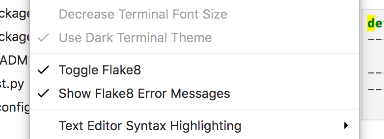
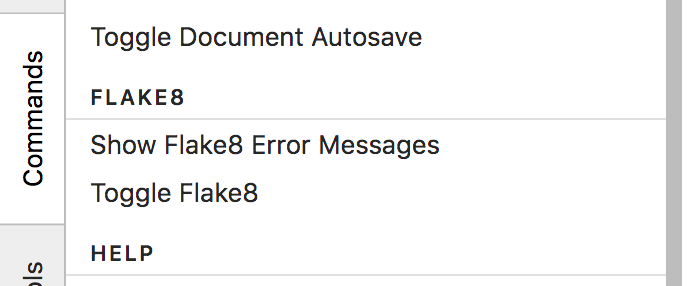

# Jupyterlab-flake8

Jupyterlab extension to lint python notebook. Uses [`flake8`](http://flake8.pycqa.org/en/latest/) python library for linting.

> Note: This extension will only work if you can load the terminal in jupyterlab. This terminal currently does [not work on Windows 7](https://github.com/jupyterlab/jupyterlab/issues/3647)


## Prerequisites

- JupyterLab >= 0.32

```bash
$ conda install -c conda-forge jupyterlab
```

- [`flake8`](http://flake8.pycqa.org/en/latest/) python package

```bash
$ conda install flake8   # if using conda
$ pip install flake8     # if using pip
```

## Installation

```bash
jupyter labextension install jupyterlab-flake8
```

## Usage

When the extension is installed, the linter will automatically be toggled on and configured to show error messages.  The linter will run when you change cells.

Currently only has two options in the view menu (or command palette):

- Toggle Flake8
    + Turns on or off linting in the notebook
- Show Error Messages
    + Shows Flake8 Error messages under the line in the notebook

 

## Configure

The notebook linter is configured the same way as the `flake8` command line tool. See the [`flake8` project configuration documentation](http://flake8.pycqa.org/en/latest/user/configuration.html#project-configuration) for all options.

As an example, if you want to ignore certain warnings:

- Create `.flake8` file in the same directory as the notebook
- Specify a `[flake8]` block in a valid INI format

```ini
[flake8]
ignore = 
    F812,   # list comprehension redefines
    H101    # Use TODO(NAME)
exclude =
    .git,
    __pycache__,
    docs/source/conf.py,
    dist
max-complexity = 10
```

The `flake8` linter will then use this configuration in the notebook.


## TODO

Please help contribute if you have time and think this is useful. I will continue to improve as I have time:

- show error messages on hover rather than in a new line
- run linter more frequently (i.e. on a new line, on save)
  - make frequency a configurable option
- extend to run in the text editor

## Development

It is advisable to use a seperate conda environment for development:

```bash
$ conda create -n jlflake8 anaconda
```

For a development install (requires npm version 4 or later), do the following in the repository directory:

```bash
$ npm install
$ npm run build
$ jupyter labextension install              # install and rebuild jupyterlab
$ jupyter labextension install --no-build   # install, but don't build (built during `jupyter lab --watch`)
```

To rebuild the package and the JupyterLab app:

```bash
$ npm run build
$ jupyter lab build
```

To run jupyter lab and thet typescript in watch mode:

```bash
$ jupyter lab --watch       # in the first terminal window
$ npm run watch             # in a new terminal window
```

Every time you add a dependency you much re-run `npm run watch`, then `jupyter lab --watch`

## Acknowledgment

- Used https://github.com/ijmbarr/jupyterlab_spellchecker as a starting point
